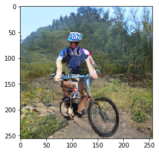
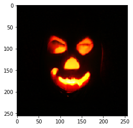

# Synthèse d'images naturelles

Ce code est basé sur l'implémentation du papier [Large Scale GAN Training for High Fidelity Natural Image Synthesis](https://openreview.net/forum?id=B1xsqj09Fm) d'Andrew Brock, Jeff Donahue and Karen Simonyan.
Le repo github original, contenant un Readme très détaillé, est disponible [ici](https://github.com/huggingface/pytorch-pretrained-BigGAN/) sous licence MIT. Les modèles pré-entrainés par les auteurs seront téléchargés automatiquement depuis un seveur AWS.

Un [document Colab](https://colab.research.google.com/drive/1aQMyzxeugQL0iHsj73s31SyfTTWdryRy) (Jupyter notebook) est disponible pour tester cette implémentation sans avoir à installer les logiciels et librairies requises. Le fichier ipynb est également disponible dans ce repo.

## Requirements
- Python 3.6
- PyTorch 1.0.1

## Exemples
Les exemples suivants on été générés avec ce GAN et le modèle biggan-deep-256 (exemple dispo dans le colab)

## Mentions légales
Cette publication a été réalisée dans le cadre du projet FEDER Digistorm, cofinancé par L’Union Européenne et la Région Wallone.

