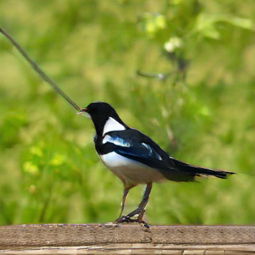
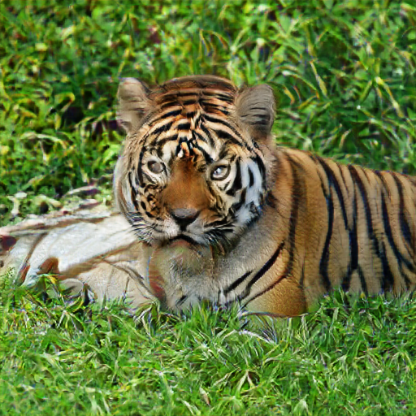
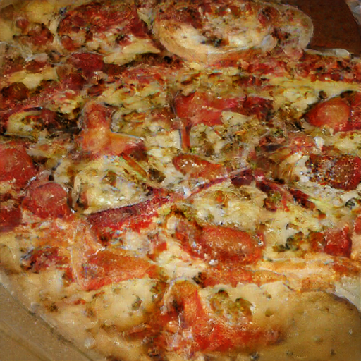

# Synthèse d'images naturelles

Ce code est basé sur l'implémentation du papier [Large Scale GAN Training for High Fidelity Natural Image Synthesis](https://arxiv.org/abs/1809.11096) d'Andrew Brock, Jeff Donahue and Karen Simonyan.
Le repo github original est disponible [ici](https://github.com/ivclab/BigGAN-Generator-Pretrained-Pytorch). Les modèles pré-entrainés par les auteurs sont téléchargeables depuis [cette page](https://github.com/ivclab/BigGAN-Generator-Pretrained-Pytorch/releases/latest).

Un [document Colab](https://colab.research.google.com/drive/1B4e2Yxq6JtRrNDn7spUmIWNRnY6EmQYL) (Jupyter notebook) est disponible pour tester cette implémentation sans avoir à installer les logiciels et librairies requises. Le fichier ipynb est également disponible dans ce repo.

## Exemples
Les exemples suivants on été générés avec ce GAN et le modèle biggan512-release (exemple dispo dans le colab)

